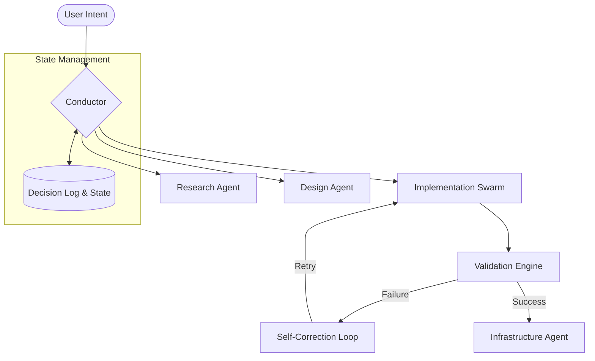

# Auto-Developer: Elite Gemini Extension

[](https://github.com/google/gemini-cli)
[](SKILL.md)
[](LICENSE)
[](references/sdlc_phases.md)

A high-fidelity **Gemini Extension (Skill)** designed for the Gemini CLI ecosystem. This extension transforms the CLI into an autonomous, multi-agent software development house, implementing a professional 7-phase SDLC.

---

## 🚀 Quick Start

To activate this extension in your Gemini CLI environment:

1. **Clone** this repository into your local skills directory.
2. Use the following command to activate:
   ```bash
   # Within Gemini CLI
   activate_skill auto-developer
   ```

---

## 🏗️ System Architecture

The ecosystem follows the **Conductor Pattern**, where a central Orchestrator manages state and coordinates specialized agents.



---

## 🔄 The Elite 7-Phase SDLC
*Click on each phase to explore the technical specifications.*

<details>
<summary><b>Phase 1: Research & Intelligence</b></summary>
<blockquote>
Systematic analysis of requirements, library landscapes, and competitive benchmarks. Focuses on gathering empirical data before any code is written.
<br><i>Reference: <code>references/research.md</code></i>
</blockquote>
</details>

<details>
<summary><b>Phase 2: Requirements & Globalization</b></summary>
<blockquote>
Definition of functional specifications with a focus on scale and international standards. Ensures the project is ready for a global audience.
<br><i>Reference: <code>references/sdlc_phases.md</code></i>
</blockquote>
</details>

<details>
<summary><b>Phase 3: System Design (Multi-Agent)</b></summary>
<blockquote>
Architectural planning using a multi-agent review process. Prevents single-point-of-failure logic in system design.
<br><i>Reference: <code>references/multi_agent.md</code></i>
</blockquote>
</details>

<details>
<summary><b>Phase 4: Implementation (Atomic Swarm)</b></summary>
<blockquote>
Granular, task-based execution. Every unit of code is treated as an atomic change, ensuring high traceability and easier debugging.
<br><i>Reference: <code>references/tech_stack.md</code></i>
</blockquote>
</details>

<details>
<summary><b>Phase 5: Validation & Visual Audit</b></summary>
<blockquote>
Comprehensive QA including unit testing, integration tests, and aesthetic consistency checks via automated visual audits.
<br><i>Reference: <code>references/quality_assurance.md</code></i>
</blockquote>
</details>

<details>
<summary><b>Phase 6: Infrastructure & Deployment</b></summary>
<blockquote>
Cloud-native deployment strategies. Orchestrates the environment needed for the application to run at scale.
<br><i>Reference: <code>references/infrastructure.md</code></i>
</blockquote>
</details>

<details>
<summary><b>Phase 7: Sustainability & Support</b></summary>
<blockquote>
Long-term maintenance, automated backups, and self-learning feedback loops to improve the system over time.
<br><i>Reference: <code>references/sustainability.md</code></i>
</blockquote>
</details>

---

## 🛠️ Technical Principles

### Conductor-Pattern Orchestration
Unlike basic automation scripts, this ecosystem uses a state-driven approach:
- **State Persistence**: Tracks every atomic task via internal state logs.
- **Autonomous Recovery**: Implements a 3-tier self-correction protocol for build and test failures.
- **Decision Logging**: Maintains an immutable log of architectural choices.

### Engineering Standards
- **Atomic Execution**: Tasks are decomposed into minimal, verifiable units.
- **Verification-First**: No phase transition occurs without passing a full system "Health Check" (Lint + Build + Test).

---

## 📂 Repository Structure

```text
├── SKILL.md                # Core logic and workflow definitions
├── references/             # Technical specifications for each SDLC phase
├── scripts/                # Supporting automation and utility scripts
└── assets/                 # System resources and architectural diagrams
```

---

## 💡 Philosophy

This project prioritizes **Engineering Excellence** over rapid prototyping. It is built on the belief that autonomous systems must be **Predictable**, **Resilient**, and **Transparent**.

---
